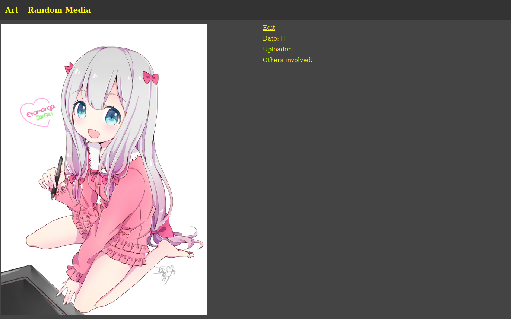
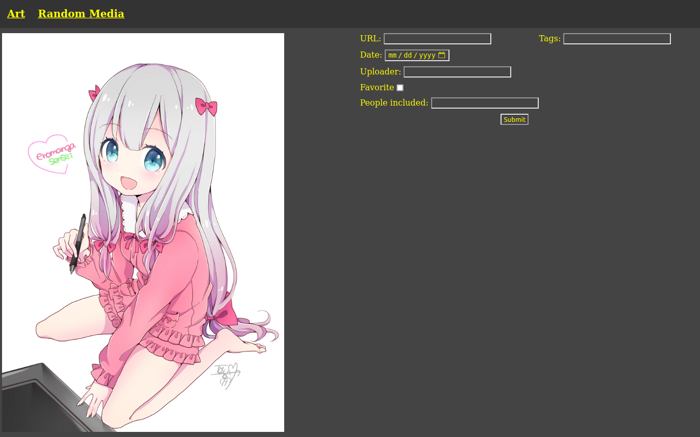

# mediatags
MediaTags is a media file tagging web based script where you can add tags/genres, url, date, creator/uploader and other people/groups included, and also "favorite" the file.

## Using the script
Currently the only thing that works are image files: jpg/jpeg, png, and gif.

Download/Clone the repo.

Run the main script with "add_new" to create list jsons. This will run the app after updating the lists.
	
	python3 run.py add_new

If you just wish to run the script without updating the lists, just remove "add_new".
	
	python3 run.py

Go to the desired list page in your web browser.
	
	http://127.0.0.1:5000/list/ + list name
In the example below the list url would be:
	
	http://127.0.0.1:5000/list/art/

Find the media you want to add tags to and press edit, adding what you wish to add. Once added, most fields do not need to be added again unless you wish to overwrite it. If you favorite something, the checkbox will remain checked next time you edit the information, as that is the only one that will always be rewritten.

[Sagiri image by "am" on Pixiv](https://www.pixiv.net/en/artworks/62477784)

